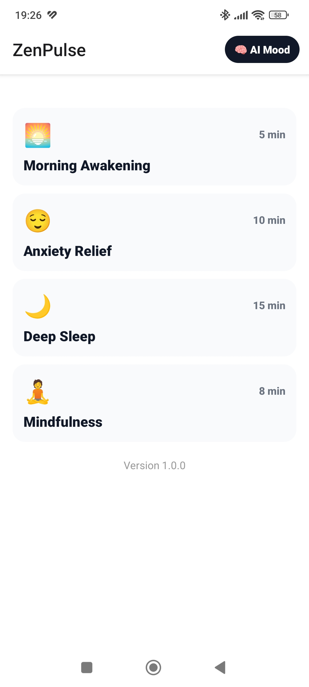
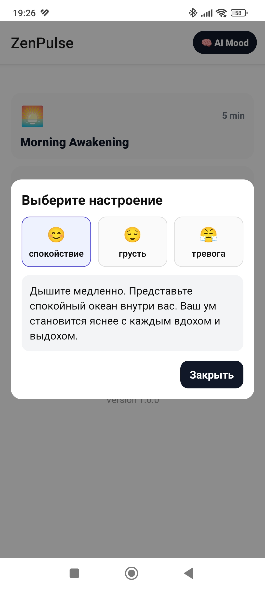

# ZenPulse: AI Meditation App

Мобильное приложение для медитации с AI-функцией генерации аффирмаций по настроению. Прототип разработан в рамках тестового задания с использованием AI-редактора Cursor.

## 📱 Демонстрация

| Paywall | Медитации | AI-настрой |
|---------|-----------|------------|
|  |  |  |

*(Замените ссылки на реальные скриншоты после создания)*

## 🛠️ Технологический стек

| Технология | Назначение |
|------------|------------|
| **React Native + Expo** | Фреймворк для кроссплатформенной разработки |
| **TypeScript** | Типизация кода |
| **React Navigation** | Навигация между экранами |
| **Expo Linear Gradient** | Градиенты на Paywall-экране |
| **React Native Gesture Handler** | Обработка жестов |
| **React Native Safe Area Context** | Адаптация под разные экраны |

## 🚀 Установка и запуск

### Требования
- Node.js 18+
- npm или yarn
- Expo Go (установить из Play Market / App Store)

### Установка

```bash
# Клонировать репозиторий
git clone https://github.com/YOUR_GITHUB_USERNAME/ZenPulseApp.git
cd ZenPulseApp

# Установить зависимости
npm install

# Запустить Metro Bundler
npx expo start
```

### Запуск на устройстве
1. Отсканируйте QR-код в терминале приложением **Expo Go**
2. Приложение откроется на телефоне

## 📂 Структура проекта

```
ZenPulseApp/
├── screens/
│   ├── PaywallScreen.tsx      # Экран подписки
│   └── MeditationsScreen.tsx  # Главный экран со списком
├── components/
│   ├── MeditationCard.tsx     # Карточка медитации
│   └── AffirmationModal.tsx   # Модалка с выбором настроения
├── context/
│   └── SubscriptionContext.tsx # Глобальное состояние подписки
├── App.tsx                     # Корневой компонент с навигацией
├── babel.config.js
├── package.json
└── README.md
```

## ✨ Функционал

### 1. Paywall (Экран подписки)
- Градиентный фон
- Список преимуществ Premium-версии
- Два тарифа: Monthly ($9.99) и Yearly ($49.99) с выделением экономии 60%
- Кнопка "Try for free" — имитация успешной покупки и открытие доступа

### 2. Медитации (Главный экран)
- Список доступных сессий (карточки с эмодзи и временем)
- Логика блокировки: премиум-карточки серые с замком при отсутствии подписки
- Нажатие на замок возвращает на Paywall

### 3. AI Настрой дня
- Кнопка "AI Mood" в заголовке
- Модальное окно с выбором настроения (😊 спокойствие / 😌 грусть / 😤 тревога)
- Генерация аффирмации (заглушка, в реальном проекте — запрос к LLM)

## 🧠 Процесс разработки с AI

Разработка велась в **Cursor** — AI-ориентированной IDE. Промпты для AI формулировались итеративно:

1. **Создание структуры:** *"Создай Expo проект с навигацией и контекстом подписки"*
2. **Верстка Paywall:** *"Добавь градиент, карточки тарифов, SafeAreaView"*
3. **Логика блокировки:** *"Если isSubscribed = false, показывай замок на премиум-карточках и веди на Paywall"*
4. **AI-функция:** *"Создай модалку с выбором эмодзи и генерацией текста-заглушки"*

AI-чат использовался для написания кода, исправления ошибок и адаптации под разные экраны.

## ❓ Ответ на контрольный вопрос

**С какими специфическими проблемами мобильной верстки ИИ справляется хуже всего и как ты контролировал его работу, чтобы приложение не сломалось на маленьких экранах (iPhone SE vs Pro Max)?**

В процессе работы с AI выявлены следующие проблемные зоны:

### 1. SafeAreaView
AI не всегда автоматически оборачивает контент в `SafeAreaView`, что приводит к наложению элементов на "челку" и системные индикаторы. 
**Контроль:** после каждого промпта проверял на эмуляторе iPhone SE и добавлял явное требование в промпт: *"оберни экран в SafeAreaView"*.

### 2. Фиксированные отступы
AI часто использует жесткие значения `marginTop: 100`, которые на маленьком экране приводят к скроллу или обрезанию кнопок.
**Контроль:** заменял на адаптивные отступы через `paddingHorizontal: 16` и `flex: 1`, добавлял `ScrollView` для Paywall-экрана.

### 3. Размеры шрифтов и кнопок
На экране iPhone SE кнопка "Try for free" иногда уменьшалась до нечитаемого размера.
**Контроль:** явно указывал `minHeight: 48` для кнопок (Apple HIG) и относительные размеры шрифтов.

### 4. Градиенты
AI корректно использовал `LinearGradient`, но иногда забывал про `flex: 1`, и градиент не растягивался на всю высоту.
**Контроль:** проверял визуально и добавлял стиль `flex: 1` к контейнеру.

### Итог
Эффективный контроль обеспечивался итеративным подходом:
1. Запрос к AI на создание компонента
2. Тестирование на эмуляторе с маленьким экраном
3. Уточняющий промпт с указанием конкретной проблемы
4. Повторная проверка

## 📹 Видео процесса разработки

*(Ссылка на видео-скринкаст, где видно работу с AI-чатом и тестирование в эмуляторе)*

## 📄 Лицензия

Тестовое задание, не для коммерческого использования.